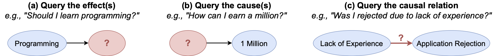

# CausalQuest: Collecting Natural Causal Questions for AI Agents

 Fig 1: Examples of three main types of causal questions in CausalQuest: (a) querying the effect given a cause, (b) querying the cause given the effect, and (c) querying the causal relation of the given variables.

**Paper: ** <https://arxiv.org/abs/2405.20318>

This repository accompanies our research paper titled "**CausalQuest: Collecting Natural Causal Questions for AI Agents**" by *Roberto Ceraolo\*, Dmitrii Kharlapenko\*, Amélie Reymond, Rada Mihalcea, Mrinmaya Sachan, Bernhard Schölkopf, Zhijing Jin*.
The repo contains the code that we used to generate the dataset, the results and the plots that we used in the paper. It also contains the labels for the CausalQuest dataset used in the paper and the code to reproduce the full dataset, which is not directly shared here because one of the sources has an unknown license.

## Get the [dataset](data/causalquest_labels.jsonl)

- jsonl file size: 9.6MB
- Version: v1
- Date: 2024-05-29

This repo contains the labels for the CausalQuest dataset used in the paper "CausalQuest: Collecting Natural Causal Questions for AI Agents", together with the code to reproduce the full dataset. The dataset contains natural questions from different sources, labeled as causal or non-causal. Causal questions are then further labeled following the taxonomy proposed in the paper. 

Follow the instructions in the [Code Setup](#code-setup) section to generate the full dataset.

### Licenses

The following are the licences for each of the sources used in the dataset:
- **ShareGPT**: Apache-2, available at [https://huggingface.co/datasets/anon8231489123/ShareGPT_Vicuna_unfiltered](https://huggingface.co/datasets/anon8231489123/ShareGPT_Vicuna_unfiltered).
- **WildChat**: AI2 ImpACT License – Low Risk Artifacts, available at [https://allenai.org/licenses/impact-lr](https://allenai.org/licenses/impact-lr)
- **MSMARCO**: Non-commercial research purposes only, available at [https://microsoft.github.io/msmarco/](https://microsoft.github.io/msmarco/)
- **NaturalQuestions**: Creative Commons Share-Alike 3.0, available at [https://ai.google.com/research/NaturalQuestions/download](https://ai.google.com/research/NaturalQuestions/download)
- **Quora**: Unknown, available at [https://huggingface.co/datasets/quora](https://huggingface.co/datasets/quora)

We invite all users of CausalQuest to carefully read and respect the licenses of the sources.

## Dataset

### Data Usage

The data is stored in .jsonl format, with each line representing a single question. Each question has the following fields:

- `query_id`: a unique (for the file) identifier for the question
- `source`: the source of the question, one of `nq`, `quora`, `msmarco`, `wildchat`, `sharegpt`
- `causal_reasoning`: a detailed reasoning for why the question is causal, given by Chain-of-thought reasoning
- `is_causal`: a boolean indicating whether the question is causal
- `domain_class`, `action_class`, `is_subjective`: class labels for the question's domain, action, and subjectivity, as proposed in the paper
- `sg_id`, `msmarco_id`, `nq_id`, `quora_id`, `wc_id`: identifiers for the question in the original sources
  
To obtain the text of the questions, follow the instructions in the [Code Setup](#code-setup) section.

### Dataset Statistics

Here are some basic statistics for the dataset. 

Number of questions: 13500, out of which 42% are causal.

Query Types:
| Causality Type               | Percentage | Example (Summarized When Needed)                                      |
|------------------------------|------------|-----------------------------------------------------------------------|
| **Classification based on the action required** |
| Cause-seeking                | 36.3%      | *Why did the Roman Empire fall?*                                      |
| Steps-seeking                | 27.8%      | *How do I start a tech channel on YouTube?*                           |
| Recommendation-seeking       | 12.2%      | *What are the best ways to improve my writing skills?*                |
| Algorithm-seeking            | 11.4%      | *How to prepare a Chettinad chicken gravy?*                           |
| Effect-seeking               | 8.5%       | *What would happen if Middleware is removed?*                         |
| Relation-seeking             | 3.8%       | *Is drinking packed juice safe and hygienic?*                         |
| **Classification based on the domain of knowledge requested to answer (main classes)** |
| Computer Science             | 25.8%      | *What are some solutions if I forgot my iCloud password?*             |
| Society, Economy & Business  | 18.8%      | *How can I start a side hustle using ChatGPT effectively?*            |
| Everyday Life & Personal Choices | 16.0%  | *How do I score well in competitive exams?*                           |
| Health and Medicine          | 10.9%      | *How do I lose weight?*                                               |
| **Classification based on whether the answer requires a subjective judgement** |
| Objective                    | 62.9%      | *Why is perpetual motion not possible?*                               |
| Subjective                   | 37.1%      | *What is the best way to live a good life?*                           |

## Repo structure

The following is the structure of the repo:

- **data**
  - causalquest_labels.jsonl: JSON Lines file containing labels for CausalQuest

- **src**
  - **dataset_generation**
    - build_causalquest.py: Script to generate the full dataset
    - dataloaders.py: Scripts to load all sources
    - utils.py: Utility functions

  - **fine_tuning**
    - train_flan_lora.py: Script to fine-tune FLAN model with LoRA
    - train_phi_lora.py: Script to fine-tune PHI model with LoRA

  - **labeling_scripts**
    - compute_annotator_agreement.py: Script to compute annotator agreement
    - dataset_generation.py: Script used to generate the dataset
    - graph_generation.py: Script to generate the graphs of the paper
    -nq_sampling.py: Script to sample from Natural Questions
    - run_batchAPI.py: Script to run the OpenAI batch API
    - run_classification.py: Script to run the normal OpenAI API
    - utils.py: Utility functions

  - **linguistic_baseline**
    - linguistic_baseline.py: Baseline linguistic models and scripts

## Code Setup

To use the codes in this repo, first clone this repo:

    git clone https://github.com/roberto-ceraolo/causal-quest
    cd causal-quest

Then, install the dependencies:

    pip install -r requirements.txt

## Code Usage

The following are the steps needed to generate the full dataset:

- Download the Natural Question data ("Simplified train set") from the [Natural Questions website](https://ai.google.com/research/NaturalQuestions/download). This is done to avoid downloading the full Natural Questions from Huggingface. All the other sources are downloaded on-the-fly.
- Unzip the file and place it in a directory, which we will refer to as `<nq_path>`.
- `<causalquest_path>` is the path of the labels' file, which is provided in the `data` directory of this repository.
- `<output_path>` is the path where the full dataset will be saved.

The following command will then generate the full dataset:

    python src/dataset_generation/build_causalquest.py <nq_path> <causalquest_path> <output_path>
